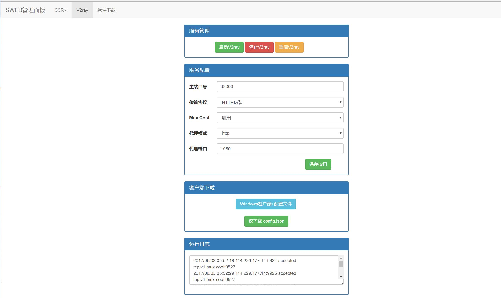
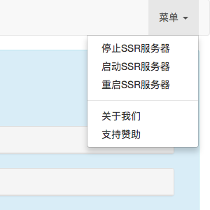
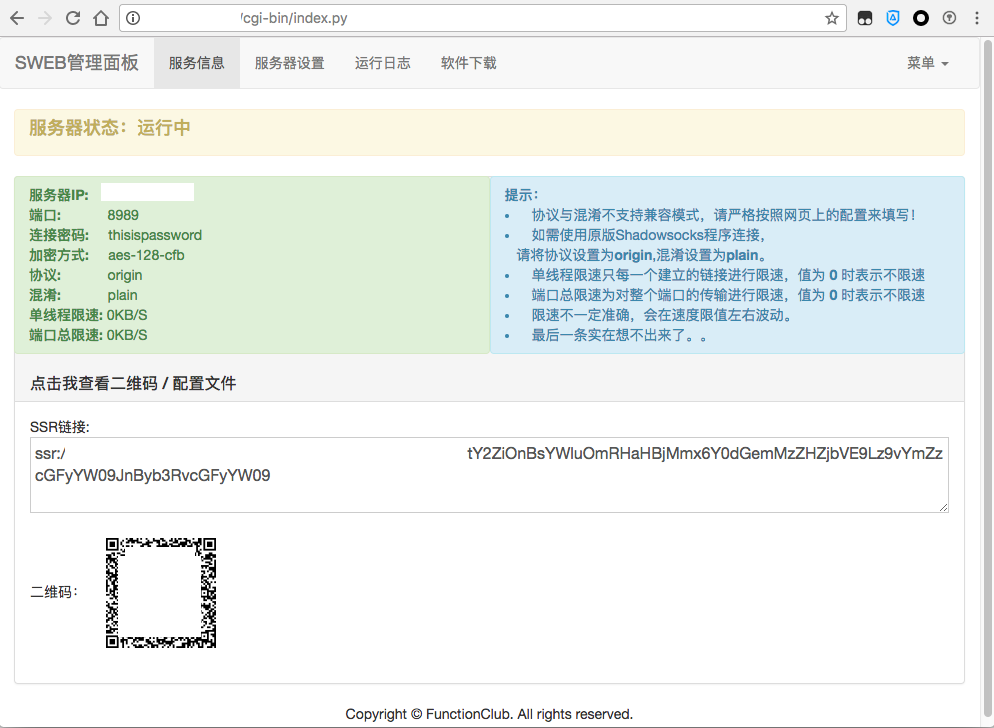
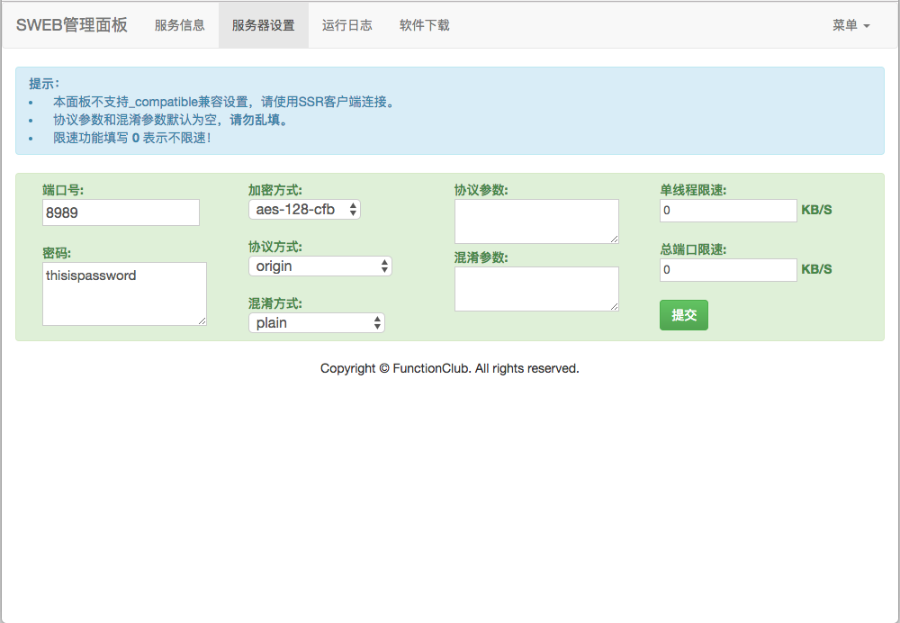
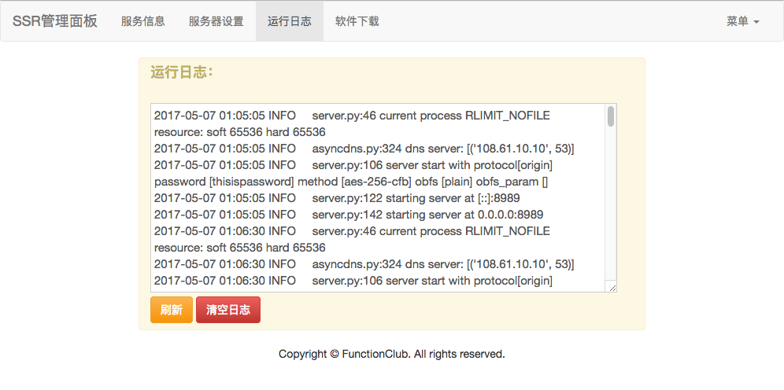

# SWEB
**个人使用**的代理工具的WEB面板。集成修改配置，开启，关闭为一体的管理功能的网页面板。设计初衷是为了让所有的**扶墙专用VPS**能有一个简单的控制面板。类似于搬瓦工那种的。目前已加入V2ray，ShadowsocksR。未来还会支持 Anyconnet等。

## 功能

- 面板里 启动/关闭/重启 SSR服务端
- 面板直接设置连接密码，端口，加密等设置选项。
- 自动修改设置防火墙
- 在WEB端显示 二维码，SSR链接
- 自助修改V2ray的端口，传输方式，Mux等选项
- 面板开关重启V2Ray服务器
- 查看运行日志
- 没有数据库，一切靠JSON，内存占用不大

## 缺点

- 未设置开机自启动，启动请手动输入 sweb 开启
- 仅仅是个人SSR WEB面板，无法进行多用户，否则JSON解析会报错
- Caddy反向代理占用 80 端口，不可同时进行网站业务。

## 系统支持

**不支持CentOS 6**

目前已经测试通过的系统有

- CentOS 7
- Ubuntu 14
- Ubuntu 16
- Debian 8

## 安装

```shell
wget -N --no-check-certificate  https://raw.githubusercontent.com/FunctionClub/SWEB/master/install.sh && bash install.sh
```

## 使用方法

安装完成后，直接输入 **http://你的IP地址** 就可以使用你设置的用户名密码进入管理啦~ 

如果要 打开/关闭 面板程序，修改面板密码，只需要在 SSH 里面输入 **sweb** 然后回车，就可以了哦。

## 截图

V2Ray页面：



SSR控制菜单：



服务器信息页



服务器设置页面：



运行日志：



客户端下载页面（其实只是觉得好看，顺手拿了过来


## 引用

- Teddysun（秋水逸冰大佬）的脚本负责SSR一键安装：https://shadowsocks.be/9.html
- Toyo（逗比根据地大佬）的Caddy脚本意见安装：https://doub.bid/shell-jc1/


## 简单声明

1. 本程序只是个人练手而已，禁止用于商业用途。卖SS没问题，请勿贩卖本程序，请尊重 GPL 协议，谢谢。
2. 请勿删除版权，你可以修改后**添加**自己的版权，请勿删除原有的底部版权信息，谢谢。
3. 请别问我写 **多用户SS面板** 个人能力和精力有限，暂时没这个计划。而且降低售卖SS的技术成本，后果你懂的。

